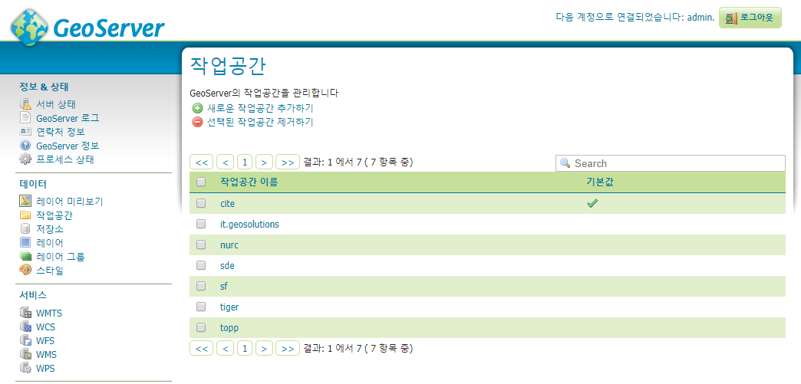

**사이트 구축 가이드**

설치 시 요구사항
================

소프트웨어
----------

-   Apache Tomcat : 본 문서에서는 8.5.38 버전 사용
-   GeoServer(2.12 버전 이상) : 본 문서에서는 2.12.5 버전 사용
    -   WPS Extentions
    -   OpenGXT + GeoTools Extentions
-   PostgreSQL(9.5 버전 이상) : 본 문서에서는 9.6.12 버전 사용
    -   PostGIS(2.3 버전 이상) : 본 문서에서는 2.4.4 버전 사용
    -   pgRouting(2.2 버전 이상) : 본 문서에서는 2.6.0 버전 사용

런타임 환경
-----------
-   OpenJDK : 본 문서에서는 1.8.0 버전 사용

자료
----

-   행정구역(남한) 자료
    -   EPSG:4326 좌표계
-   도로망 GIS 자료
    -   국가교통DB센터(KTDB) - <https://www.ktdb.go.kr/www/index.do>
    -   node, link, turn 테이블
    -   EPSG:4326 좌표계
-   수치표고모델 자료(DEM)
    -   SRTM 한반도 전역(30m)
    -   EPSG:4326 좌표계
-   EPSG 사용자 좌표계
-   위성영상-시계열 자료

GeoServer
=========

GeoServer
---------

-   <http://geoserver.org/release/2.12.5/>
-   Tomcat 에 war 형태로 올려서 서비스하기 위해 Web Archive 버전을 다운로드  
<http://sourceforge.net/projects/geoserver/files/GeoServer/2.12.5/geoserver-2.12.5-war.zip>
-   압축을 풀어 생성된 geoserver.war 파일을 Tomcat webapps 에 복사
-   Tomcat 재시작 후 webapps 에 geoserver 폴더 생성 확인
-   http://localhost:8080/geoserver 접속 확인


사용자 좌표계 추가
------------------

GEOSERVER_DATA_DIR 경로의 user_projections 폴더에 자료를 복사
```
$(GEOSERVER_DATA_DIR)/user_projections/epsg.properties

$(GEOSERVER_DATA_DIR)/user_projections/epsg_overrides.properties
```

WPS Extentions
--------------

-   GeoServer 버전에 맞는 플러그인을 다운로드(Extensions/Services/WPS 다운로드)  
<http://sourceforge.net/projects/geoserver/files/GeoServer/2.12.5/extensions/geoserver-2.12.5-wps-plugin.zip>
    -   gs-web-wps-2.12.5.jar
    -   gs-wps-core-2.12.5.jar
    -   gt-process-geometry-18.5.jar
    -   gt-xsd-wps-18.5.jar
    -   net.opengis.wps-18.5.jar
    -   serializer-2.7.1.jar
-   압축을 풀고 .jar 파일들을 GeoServer 의 WEB-INF/lib 에 복사
-   GeoServer 재시작 후 서비스 항목에 WPS 확인

  
그림 . GeoServer WPS 서비스 항목 확인

OpenGXT + GeoTools Extentions
-----------------------------

-   OpenGXT - Spatial Analysis Tools :
    <https://sourceforge.net/projects/mango-spatialstatistics/>
-   분석 기능을 위한 플러그인을 다운로드(GeoServer 버전 2.8.5 \~ 2.12.5 지원)
    -   gs-wps-spatialstatistics-2.8.5.jar
    -   gt-process-spatialstatistics-14.5.jar
-   다운로드 받은 파일들을 GeoServer 의 WEB-INF/lib 에 복사
-   GeoServer 재시작 후 바인딩된 WPS 프로세스 확인

* GeoServer 관리자 페이지 \> 데모 \> WPS 요청 빌더  
    : statistics 네임스페이스 프로세스 리스트 확인 또는 서버 로딩 시 로그에서 확인

  
그림 . GeoServer 관리자 페이지에서 WPS statistics 프로세스 리스트 확인

  
그림 . 서버의 GeoServer 로그에서 WPS statistics 프로세스 리스트 확인

작업공간 생성
-------------

- GeoServer 관리자 페이지 \> 데이터 / 작업공간  
    : 새로운 작업공간 추가하기

  
그림 . GeoServer – 작업공간

-   기본 작업공간
```
Name : mago3d
네임스페이스 URI : http://www.mago3d.com
기본 작업공간으로 설정하기 체크
```

  
그림 . GeoServer - 새로운 작업공간 추가하기(mago3d)

-   분석기능 관련 작업공간
```
Name : statistics
네임스페이스 URI : https://www.statistics.org
```

  
그림 . GeoServer - 새로운 작업공간 추가하기(statistics)

  
그림 . GeoServer – 작업공간 생성 확인

PostgreSQL
==========

PostgreSQL
----------

-   설치 방법 생략
-   데이터베이스 생성

```sql
CREATE DATABASE mago3d
    WITH 
    OWNER = postgres
    TEMPLATE = template0
    ENCODING = 'UTF8'
    LC_COLLATE = 'C'
    LC_CTYPE = 'C'
    TABLESPACE = pg_default
    CONNECTION LIMIT = -1;
```


PostGIS
-------

-   PostgreSQL 9.1 버전 이상, 래스터 지원 가능한 PostGIS 2.2 버전 이상으로 설치  
    (래스터 지원이 되지 않는 PostGIS 의 경우, CREATE EXTENSION을 사용할 수 없음)
-   각 데이터베이스에 PostGIS 를 사용하도록 설정하여 PostGIS 활성화  
    (postgres 데이터베이스에는 설치하지 말 것)
-   psql 또는 PgAdmin을 사용하여 데이터베이스에 연결 후 다음 SQL을 실행

```sql
-- Enable PostGIS (includes raster)
CREATE EXTENSION postgis;
```

-   요구되는 버전보다 낮은 버전의 PostGIS 가 이미 설치된 경우 최신 버전 설치 후 업그레이드
```sql
-- Upgrade PostGIS (includes raster) to latest version 
ALTER EXTENSION postgis UPDATE;
```

또는
```sql
-- Upgrade PostGIS (includes raster) to a specific version 
ALTER EXTENSION postgis UPDATE TO "2.4.4";
```

PostGIS를 업그레이드하려면 먼저 최신 바이너리를 설치 한 다음 PostGIS가 설치된 각 데이터베이스를 업그레이드 해야한다. 더 자세한 지침은 PostGIS 설치를 참조.

-   OSM 사용 등 토폴로지를 이용한 네트워크 구성시 필요

```sql
CREATE EXTENSION postgis_topology;
```

pgRouting
---------

-   설치된 PostgreSQL 및 PostGIS 에 맞는 pgRouting 설치
-   각 데이터베이스에 pgRouting 을 사용하도록 설정하여 pgRouting 활성화
-   psql 또는 PgAdmin을 사용하여 데이터베이스에 연결 후 다음 SQL을 실행

```sql
-- Enable pgRouting 
CREATE EXTENSION pgrouting;
```

-   요구되는 버전보다 낮은 버전의 PostGIS 가 이미 설치된 경우 최신 버전 설치 후 업그레이드

```sql
-- Upgrade pgRouting to latest version 
ALTER EXTENSION pgrouting UPDATE;
```

또는

```sql
-- Upgrade pgRouting to a specific version 
ALTER EXTENSION pgrouting UPDATE TO "2.6.0";
```

pgRouting 을 업그레이드하려면 먼저 최신 바이너리를 설치 한 다음 pgRouting 이 설치된 각 데이터베이스를 업그레이드 해야한다. 더 자세한 지침은 pgRouting 설치를 참조.

설치 확인
---------

```sql
SELECT postgis_version();
SELECT pgr_version();
```


자료처리
========

행정구역-남한(4326)
-------------------

### 데이터베이스에 자료 등록

-   방법1 : Shape 파일을 PostgreSQL 데이터베이스에 등록
    -   Z_NGII_N3A_G0010000.shp : 행정구역(시도)
    -   Z_NGII_N3A_G0100000.shp : 행정구역(시군구)
    -   Z_NGII_N3A_G0110000.shp : 행정구역(읍면동)

-   방법2 : sql 파일을 psql 또는 pgAdmin 으로 테이블 생성 및 등록
    -   ddl-sk_sdo.sql : 행정구역(시도) 테이블
    -   ddl-sk_sgg.sql : 행정구역(시군구) 테이블
    -   ddl-sk_emd.sql : 행정구역(읍면동) 테이블
    -   dml-sk_sdo.sql : 행정구역(시도) 데이터
    -   dml-sk_sgg.sql : 행정구역(시군구) 데이터
    -   dml-sk_emd.sql : 행정구역(읍면동) 데이터

### GeoServer에 자료 등록

#### 데이터 저장소 등록

-   GeoServer 관리자 페이지 \> 데이터 / 저장소  
    : 새로운 저장소 생성하기

  
그림 . GeoServer – 저장소

-   벡터 데이터 저장소  
    : PostGIS - PostGIS Database

  
그림 . GeoServer – 새로운 데이터 저장소

```
- 기본 저장소 정보
    작업공간 : mago3d 
    데이터 저장소 이름 : postgis 
    활성화 체크

- 연결 파라미터
    host : localhost
    port : 5432
    database : mago3d
    schema : public
    user : {{사용자 입력}}
    passwd : {{사용자 비밀번호 입력}}
```

  
그림 . GeoServer – 벡터 데이터 저장소 추가(PostGIS)

#### 데이터 스타일 등록

-   GeoServer 관리자 페이지 \> 데이터 / 스타일  
    : 새로운 스타일 추가하기

  
그림 . GeoServer – 스타일

-   새로운 스타일 추가
```
- 스타일 데이터
    이름 : sk_sdo 
    작업공간 : mago3d 
    포맷 : SLD
```

“파일 선택” 을 누르고 스타일 파일(sld-sk_sdo.sld) 을 업로드하거나
스타일 편집기에 스타일 파일의 내용을 복사하여 붙여넣기한다.

  
그림 . GeoServer – 새로운 스타일 등록

“유효성 검증하기” 를 눌러 오류가 없음을 확인한 후 “적용하기” 및 “제출” 클릭하여 등록 완료

-   동일한 방법으로 sk_sdo, sk_sgg, sk_emd, district 스타일을 등록한다.
    -   sld-sk_sdo.sld : 행정구역(시도) 스타일
    -   sld-sk_sgg.sld : 행정구역(시군구) 스타일
    -   sld-sk_emd.sld : 행정구역(읍면동) 스타일
    -   sld-district.sld : 행정구역 그룹 스타일

  
그림 . GeoServer – 스타일 추가

#### 데이터 레이어 등록

-   GeoServer 관리자 페이지 \> 데이터 / 레이어  
    : 새로운 레이어 추가하기

  
그림 . GeoServer – 레이어

-   새로운 레이어 – 다음 저장소에서 레이어 생성 : mago3d:postgis 선택

  
그림 . GeoServer – 새로운 레이어

-   “발행하기” 클릭 및 레이어 편집/등록

-   레이어 편집 / 데이터
```
- 공간 좌표 체계
    원본 데이터 좌표 체계 : EPSG:4326
    정의한 좌표체계 : EPSG:4326

- 레이어 최소경계 영역
    원본 데이터 최소경계 영역 : “데이터로부터 계산하기” 클릭
    위/경도 영역 : “원본 영역으로부터 계산하기” 클릭
```

-   레이어 편집 / 발행
```
- HTTP 설정
    캐시 설정 : 응답 캐시 해더 여부 
    캐시 시간(초) :

- WMS 설정 / 레이어 설정
    기본 스타일 : {{앞서 추가한 레이어 이름과 동일한 이름의 스타일 선택}}
```

-   레이어 편집 / 차원
```
- 시간 : 활성화 여부
- 고도 : 활성화 여부
```

-   레이어 편집 / Tile Caching
```
- 타일 캐시 설정
    이 레이어의 캐시 레이어 생성 : 체크
    이 레이어의 타일 캐시 활성화 : 체크
```

-   sk_sdo, sk_sgg, sk_emd 에 대한 레이어를 발행

#### 레이어 그룹 등록

-   GeoServer 관리자 페이지 \> 데이터 / 레이어 그룹  
    : 새로운 레이어 그룹 생성하기

-   레이어 그룹 / 데이터
```
이름 : district
작업공간 : mago3d

- 레이어 목록
    "레이어 추가하기" 클릭
    sk_sdo, sk_sgg, sk_emd 에 대한 레이어를 추가
    3개의 각 레이어의 스타일을 "district" 로 변경하여 대체 스타일 등록
    "데이터 최소경계 영역 계산하기" 클릭 및 "저장" 버튼 클릭
```

-   레이어 그룹 / Tile Caching
```
- 타일 캐시 설정
    이 레이어의 캐시 레이어 생성 : 체크
    이 레이어의 타일 캐시 활성화 : 체크
```

#### 등록된 레이어 확인

-   GeoServer 관리자 페이지 \> 데이터 / 레이어 미리보기  
    : 공통포맷 항목의 OpenLayers 선택

  
그림 . GeoServer – 레이어 미리보기

  
그림 . 왼쪽부터 행정구역 시도, 시군구, 읍명동 레이어 미리보기

도로망
------

### 데이터베이스에 자료 등록

-   방법1 : Shape 파일을 PostgreSQL 데이터베이스에 등록
    -   link.shp : 도로망 링크
    -   node.shp : 도로망 노드
    -   turn.shp : 도로망 회전제한

-   방법2 : sql 파일을 psql 또는 pgAdmin 으로 테이블 생성 및 등록
    -   dml-link.sql : 도로망 링크
    -   dml-node.sql : 도로망 노드
    -   dml-turn.sql : 도로망 회전제한

#### 데이터베이스에 자료 구성

-   도로망 노드 구성
-   도로망 링크 구성


#### 데이터베이스에 함수 추가

-   도로망 자료를 pgRouting 에 사용하기 위해 pgr_fromAtoB 사용자 함수 추가

#### 데이터베이스 결과 조회

-   SQL 결과 확인
```sql
SELECT * FROM pgr_fromAtoB('link', 'node', 14121023.116,4509507.903, 14134472.679,4494923.675, 3857, 4326, true);
```


### GeoServer에 자료 등록

#### 데이터 저장소 등록

-   GeoServer 관리자 페이지 \> 데이터 / 저장소  
    : 새로운 저장소 생성하기

-   벡터 데이터 저장소  
    : PostGIS - PostGIS Database

```
- 기본 저장소 정보
    작업공간 : mago3d
    데이터 저장소 이름 : postgis 활성화 체크

- 연결 파라미터
    host : localhost
    port : 5432
    database : mago3d
    schema : public
    user : {{사용자 입력}}
    passwd : {{사용자 비밀번호 입력}}
```

#### 데이터 스타일 등록

-   GeoServer 관리자 페이지 \> 데이터 / 스타일  
    : 새로운 스타일 추가하기

-   새로운 스타일 추가
```
- 스타일 데이터
    이름 : link
    작업공간 : mago3d
    포맷 : SLD
```

“파일 선택” 을 누르고 스타일 파일(sld-link.sld) 을 업로드하거나  
스타일 편집기에 스타일 파일의 내용을 복사하여 붙여넣기한다.  
“유효성 검증하기” 를 눌러 오류가 없음을 확인한 후 “적용하기” 및 “제출” 클릭하여 등록 완료.

#### 데이터 레이어 등록
-   GeoServer 관리자 페이지 \> 데이터 / 레이어  
    : 새로운 레이어 추가하기

-   새로운 레이어 – 다음 저장소에서 레이어 생성 : mago3d:postgis 선택

  
그림 . GeoServer – 새로운 레이어

-   도로망 link 레이어 “발행하기” 클릭 및 레이어 편집/등록

-   레이어 편집 / 데이터
```
- 레이어 기본정보
    이름 : link

- 공간 좌표 체계
    원본 데이터 좌표 체계 : EPSG:4326
    정의한 좌표체계 : EPSG:4326

- 레이어 최소경계 영역
    원본 데이터 최소경계 영역 : “데이터로부터 계산하기” 클릭
    위/경도 영역 : “원본 영역으로부터 계산하기” 클릭
```

-   레이어 편집 / 발행
```
- HTTP 설정
    캐시 설정 : 응답 캐시 해더 여부
    캐시 시간(초) :

- WMS 설정 / 레이어 설정
    기본 스타일 : mago3d:link
```

-   레이어 편집 / 차원
```
- 시간 : 활성화 여부

- 고도 : 활성화 여부
```

-   레이어 편집 / Tile Caching
```
- 타일 캐시 설정
    이 레이어의 캐시 레이어 생성 : 체크
    이 레이어의 타일 캐시 활성화 : 체크
```

#### 레이어 SQL View 등록

-   GeoServer 관리자 페이지 \> 데이터 / 레이어 : 새로운 레이어 추가하기
-   새로운 레이어 – 다음 저장소에서 레이어 생성 : mago3d:postgis 선택
-   "새로운 SQL 뷰 설정하기..." 클릭

  
그림 . GeoServer – 레이어 등록(SQL View 설정)

-   새로운 SQL 뷰 생성
```
- 뷰 이름
    pgr_fromAtoB

- SQL 구문
    SELECT * FROM pgr_fromAtoB('%link%', '%node%', %x1%, %y1%, %x2%, %y2%, 4326, 4326, %routeType%) ORDER BY seq
```

- SQL 뷰 파라미터 설정 : "SQL로부터 파라미터 추론하기" 클릭  
    : 표 내용과 같이 기본값을 입력

| **이름**  | **기본값** | **유효성 검사 정규 표현식** |
|-----------|------------|-----------------------------|
| node      | node       |                             |
| link      | link       |                             |
| y1        | 37.399635  |                             |
| x1        | 126.970092 |                             |
| y2        | 37.479537  |                             |
| x2        | 126.884548 |                             |
| routeType | false      |                             |

표 . SQL View 파라미터 설정

**(x1,y1) (x2,y2) 는 EPSG:4326 좌표계로 임의값으로 입력이 가능하며 bounding box 생성 가능한 값으로 설정해야한다.**


-   "Geometry 유형 및 SRID 추론하기" 체크 후 "새로고침" 클릭  
    : 속성 항목들의 유형을 확인

특히, geom 항목의 유형값이 MultiLineString, SRID 값이 4326 인지 확인

  
그림 . GeoServer – 새로운 SQL 뷰 생성

-   레이어 편집/등록  
    이름 : pgr_fromAtoB 확인

-   레이어 편집 / 데이터
```
- 공간 좌표 체계
    원본 데이터 좌표 체계 : EPSG:4326
    정의한 좌표체계 : EPSG:4326

- 레이어 최소경계 영역
    원본 데이터 최소경계 영역 : “데이터로부터 계산하기” 클릭
    위/경도 영역 : “원본 영역으로부터 계산하기” 클릭
```

- 레이어 편집 / 발행
```
- HTTP 설정 
    캐시 설정 : 응답 캐시 해더 여부 
    캐시 시간(초) :

- WMS 설정 / 레이어 설정
    기본 스타일 : line
```

-   레이어 편집 / 차원
```
- 시간 : 활성화 여부

- 고도 : 활성화 여부
```

-   레이어 편집 / Tile Caching
```
- 타일 캐시 설정
    이 레이어의 캐시 레이어 생성 : 체크
    이 레이어의 타일 캐시 활성화 : 체크
```

-   "저장" 클릭 및 등록 완료

#### 등록된 레이어 확인

-   GeoServer 관리자 페이지 \> 데이터 / 레이어 미리보기  
    : 공통포맷 항목의 OpenLayers 선택

-   mago3d:link

  
그림 . 도로망 링크 레이어 미리보기

-   mago3d:pgr_fromAtoB  
    : SQL 뷰 파라미터의 기본값에 따라 경로가 생성됨

(주)망고시스템 에서 가이아쓰리디(주) 까지 최적거리

  
그림 . 경로탐색 레이어 미리보기

수치표고모델(DEM)
-----------------

### GeoServer에 자료 등록

GEOSERVER_DATA_DIR 경로의 data 폴더 아래에 적당한 이름의 폴더를 생성 후 DEM(srtm_korea_dem.tif) 자료를 복사

```
$(GEOSERVER_DATA_DIR)/data/mago3d/srtm_korea_dem.tif
```

#### 데이터 저장소 등록

-   GeoServer 관리자 페이지 \> 데이터 / 저장소  
    : 새로운 저장소 생성하기

-   레스터 데이터 저장소  
    : GeoTIFF - Tagged Image File Format with Geographic information

```
- 기본 저장소 정보
    작업공간 : mago3d
    데이터 저장소 이름 : dem 
    활성화 체크

- 연결 파라미터 : "탐색" 클릭 후 DEM 파일선택
    URL : file:data/mago3d/srtm_korea_dem.tif
```

-   "저장" 클릭 후 저장소 등록 완료

#### 데이터 레이어 등록

-   GeoServer 관리자 페이지 \> 데이터 / 레이어 : 새로운 레이어 추가하기
-   새로운 레이어 – 다음 저장소에서 레이어 생성 : mago3d:dem 선택
-   “발행하기” 클릭 및 레이어 편집/등록

* 레이어 편집 / 데이터
```
- 레이어 기본 정보 
    이름 : dem

- 공간 좌표 체계
    원본 데이터 좌표 체계 : EPSG:4326
    정의한 좌표체계 : EPSG:4326

- 레이어 최소경계 영역
    원본 데이터 최소경계 영역 : “데이터로부터 계산하기” 클릭
    위/경도 영역 : “원본 영역으로부터 계산하기” 클릭
```

-   레이어 편집 / 발행
```
- HTTP 설정 
    캐시 설정 : 응답 캐시 해더 여부
    캐시 시간(초) :

- WMS 설정 / 레이어 설정
    기본 스타일 : raster
```

-   레이어 편집 / 차원
```
- 시간 : 활성화 여부

- 고도 : 활성화 여부
```

-   레이어 편집 / Tile Caching
```
- 타일 캐시 설정
    이 레이어의 캐시 레이어 생성 : 체크
    이 레이어의 타일 캐시 활성화 : 체크
```

-   "저장" 클릭 후 레이어를 발행

#### 등록된 레이어 확인

-   GeoServer 관리자 페이지 \> 데이터 / 레이어 미리보기  
    : 공통포맷 항목의 OpenLayers 선택

-   mago3d:dem

  
그림 . 수치표고모델 레이어 미리보기


위성영상-시계열
---------------

### GeoServer에 자료 등록

GEOSERVER_DATA_DIR 경로의 data 폴더 아래에 적당한 이름의 폴더를 생성 후 timeseries 자료를 복사

```
$(GEOSERVER_DATA_DIR)/data/mago3d/timeseries
```

#### 데이터 저장소 등록

-   GeoServer 관리자 페이지 \> 데이터 / 저장소  
    : 새로운 저장소 생성하기

-   레스터 데이터 저장소  
    : ImageMosaic - Image mosaicking plugin

```
- 기본 저장소 정보
    작업공간 : mago3d
    데이터 저장소 이름 : timeseries
    활성화 체크

-   연결 파라미터 : "탐색" 클릭 후 timeseries 폴더 선택
    URL : file:data/mago3d/timeseries
```

-   "저장" 클릭 후 저장소 등록 완료

#### 데이터 레이어 등록

-   GeoServer 관리자 페이지 \> 데이터 / 레이어 : 새로운 레이어 추가하기
-   새로운 레이어 – 다음 저장소에서 레이어 생성 : mago3d:timeseries 선택
-   “발행하기” 클릭 및 레이어 편집/등록

*   레이어 편집 / 데이터
```
- 레이어 기본 정보
    이름 : timeseries

- 공간 좌표 체계
    원본 데이터 좌표 체계 : EPSG:4326
    정의한 좌표체계 : EPSG:4326

- 레이어 최소경계 영역
    원본 데이터 최소경계 영역 : “데이터로부터 계산하기” 클릭
    위/경도 영역 : “원본 영역으로부터 계산하기” 클릭

- 커버리지 파라미터
    InputTransparentColor :
```


-   레이어 편집 / 발행
```
- HTTP 설정
캐시 설정 : 응답 캐시 해더 여부
캐시 시간(초) :

- WMS 설정 / 레이어 설정
    기본 스타일 : raster
```

-   레이어 편집 / 차원
```
- 시간 : 활성화 여부

- 고도 : 활성화 여부
```

-   레이어 편집 / Tile Caching
```
- 타일 캐시 설정
    이 레이어의 캐시 레이어 생성 : 체크
    이 레이어의 타일 캐시 활성화 : 체크
```

-   "저장" 클릭 후 레이어를 발행

#### 등록된 레이어 확인

-   GeoServer 관리자 페이지 \> 데이터 / 레이어 미리보기  
    : 공통포맷 항목의 OpenLayers 선택

-   mago3d:dem

WCS 요청 확인
-------------

-   GeoServer 관리자 페이지 \> 데모 \> WCS 요청 빌더
```
- WCS버전 : 1.1.1
  
- 커버리지 이름 : mago3d:dem
  
- 커버리지 공간 서브셋
    Min X : 122.99986111111112
    Min Y : 32.999861111111116
    Max X : 132.0001388888889
    Max Y : 44.00013888888889

- 공간 좌표 체계 : EPSG:4326

- 출력 커버리지 레이아웃 : 레이아웃 자동 생성

- 출력 SRS : EPSG:4326

- 출력 포맷 : image/geotiff
```


  
그림 . GeoServer - WCS 요청빌더

-   "GetCoverage XML 생성" 클릭 후 XML 확인
```xml
<?xml version="1.0" encoding="UTF-8"?><GetCoverage version="1.1.1" service="WCS" xmlns:xsi="http://www.w3.org/2001/XMLSchema-instance" xmlns="http://www.opengis.net/wcs/1.1.1" xmlns:ows="http://www.opengis.net/ows/1.1" xmlns:gml="http://www.opengis.net/gml" xmlns:ogc="http://www.opengis.net/ogc" xsi:schemaLocation="http://www.opengis.net/wcs/1.1.1 http://schemas.opengis.net/wcs/1.1.1/wcsAll.xsd">
  <ows:Identifier>mago3d:dem</ows:Identifier>
  <DomainSubset>
    <ows:BoundingBox crs="urn:ogc:def:crs:EPSG::4326">
      <ows:LowerCorner>32.999861111111116 122.99986111111112</ows:LowerCorner>
      <ows:UpperCorner>44.00013888888889 132.0001388888889</ows:UpperCorner>
    </ows:BoundingBox>
  </DomainSubset>
  <Output store="true" format="image/tiff">
    <GridCRS>
      <GridBaseCRS>urn:ogc:def:crs:EPSG::4326</GridBaseCRS>
      <GridType>urn:ogc:def:method:WCS:1.1:2dSimpleGrid</GridType>
      <GridOffsets>2.7777777777777794E-4 -2.777777777777777E-4</GridOffsets>
      <GridCS>urn:ogc:def:cs:OGC:0.0:Grid2dSquareCS</GridCS>
    </GridCRS>
  </Output>
</GetCoverage>
```

WPS 요청 예제
-------------

-   GeoServer 관리자 페이지 \> 데모 \> WPS 요청 빌더

```
- 프로세스 선택
    statistics:RadialLineOfSight
- 프로세스 입력 파라미터
    inputCoverage : RASTER_LAYER / mago3d:dem
    observerPoint : TEXT / application/wkt / POINT (127.0839224660420737.50788127085897)
    observerOffset : 170
    radius : 100
    sides : 90
    useCurvature : True
    useRefraction : True
    refractionFactor : 0.13

- 프로세스 출력 파라미터
    result : application/vnd.geo+json
```

  
그림 . GeoServer - WPS 요청빌더(가시권분석)

-   요청 XML 생성하기

"프로세스 입/출력 정보로부터 XML 생성하기" 클릭

```xml
<?xml version="1.0" encoding="UTF-8"?><wps:Execute version="1.0.0" service="WPS" xmlns:xsi="http://www.w3.org/2001/XMLSchema-instance" xmlns="http://www.opengis.net/wps/1.0.0" xmlns:wfs="http://www.opengis.net/wfs" xmlns:wps="http://www.opengis.net/wps/1.0.0" xmlns:ows="http://www.opengis.net/ows/1.1" xmlns:gml="http://www.opengis.net/gml" xmlns:ogc="http://www.opengis.net/ogc" xmlns:wcs="http://www.opengis.net/wcs/1.1.1" xmlns:xlink="http://www.w3.org/1999/xlink" xsi:schemaLocation="http://www.opengis.net/wps/1.0.0 http://schemas.opengis.net/wps/1.0.0/wpsAll.xsd">
  <ows:Identifier>statistics:RadialLineOfSight</ows:Identifier>
  <wps:DataInputs>
    <wps:Input>
      <ows:Identifier>inputCoverage</ows:Identifier>
      <wps:Reference mimeType="image/tiff" xlink:href="http://geoserver/wcs" method="POST">
        <wps:Body>
          <wcs:GetCoverage service="WCS" version="1.1.1">
            <ows:Identifier>mago3d:dem</ows:Identifier>
            <wcs:DomainSubset>
              <ows:BoundingBox crs="http://www.opengis.net/gml/srs/epsg.xml#4326">
                <ows:LowerCorner>122.99986111111112 32.999861111111116</ows:LowerCorner>
                <ows:UpperCorner>132.0001388888889 44.00013888888889</ows:UpperCorner>
              </ows:BoundingBox>
            </wcs:DomainSubset>
            <wcs:Output format="image/tiff"/>
          </wcs:GetCoverage>
        </wps:Body>
      </wps:Reference>
    </wps:Input>
    <wps:Input>
      <ows:Identifier>observerPoint</ows:Identifier>
      <wps:Data>
        <wps:ComplexData mimeType="application/wkt"><![CDATA[POINT (127.08392246604207 37.50788127085897)]]></wps:ComplexData>
      </wps:Data>
    </wps:Input>
    <wps:Input>
      <ows:Identifier>observerOffset</ows:Identifier>
      <wps:Data>
        <wps:LiteralData>170</wps:LiteralData>
      </wps:Data>
    </wps:Input>
    <wps:Input>
      <ows:Identifier>radius</ows:Identifier>
      <wps:Data>
        <wps:LiteralData>100</wps:LiteralData>
      </wps:Data>
    </wps:Input>
    <wps:Input>
      <ows:Identifier>sides</ows:Identifier>
      <wps:Data>
        <wps:LiteralData>90</wps:LiteralData>
      </wps:Data>
    </wps:Input>
    <wps:Input>
      <ows:Identifier>useCurvature</ows:Identifier>
      <wps:Data>
        <wps:LiteralData>True</wps:LiteralData>
      </wps:Data>
    </wps:Input>
    <wps:Input>
      <ows:Identifier>useRefraction</ows:Identifier>
      <wps:Data>
        <wps:LiteralData>True</wps:LiteralData>
      </wps:Data>
    </wps:Input>
    <wps:Input>
      <ows:Identifier>refractionFactor</ows:Identifier>
      <wps:Data>
        <wps:LiteralData>0.13</wps:LiteralData>
      </wps:Data>
    </wps:Input>
  </wps:DataInputs>
  <wps:ResponseForm>
    <wps:RawDataOutput mimeType="application/vnd.geo+json">
      <ows:Identifier>result</ows:Identifier>
    </wps:RawDataOutput>
  </wps:ResponseForm>
</wps:Execute>
```
표 . WPS 요청XML 생성

-   WPS 실행하기(결과)

"프로세스 실행하기" 클릭
```json
{
  "type": "FeatureCollection",
  "features": [
    {
      "type": "Feature",
      "geometry": {
        "type": "MultiLineString",
        "coordinates": [
          [
            [127.083922466, 37.5078812709, 1],
            [127.083922466, 37.5075809359, 1],
            [127.083922466, 37.5072806009, 1],
            [127.083922466, 37.5069802659, 1]
          ]
        ]
      },
      "properties": { "Angle": 0.0, "Visible": 1 },
      "id": "RadialLineOfSight.1"
    },
    {
      "type": "Feature",
      "geometry": {
        "type": "MultiLineString",
        "coordinates": [
          [
            [127.083922466, 37.5078812709, 1],
            [127.0838961678, 37.5075816675, 1],
            [127.0838698696, 37.5072820641, 1],
            [127.0838435714, 37.5069824606, 1]
          ]
        ]
      },
      "properties": { "Angle": 4.0, "Visible": 1 },
      "id": "RadialLineOfSight.2"
    },
    {
      "type": "Feature",
      "geometry": {
        "type": "MultiLineString",
        "coordinates": [
          [
            [127.083922466, 37.5078812709, 1],
            [127.0838699977, 37.5075838587, 1],
            [127.0838175294, 37.5072864465, 1],
            [127.083765061, 37.5069890343, 1]
          ]
        ]
      },
      "properties": { "Angle": 8.0, "Visible": 1 },
      "id": "RadialLineOfSight.3"
    },
    {
      "type": "Feature",
      "geometry": {
        "type": "MultiLineString",
        "coordinates": [
          [
            [127.083922466, 37.5078812709, 1],
            [127.0838440832, 37.5075874988, 1],
            [127.0837657004, 37.5072937268, 1],
            [127.0836873175, 37.5069999548, 1]
          ]
        ]
      },
      "properties": { "Angle": 12.0, "Visible": 1 },
      "id": "RadialLineOfSight.4"
    },
    {
      "type": "Feature",
      "geometry": {
        "type": "MultiLineString",
        "coordinates": [
          [
            [127.083922466, 37.5078812709, 1],
            [127.0838185506, 37.5075925702, 1],
            [127.0837146351, 37.5073038695, 1],
            [127.0836107196, 37.5070151689, 1]
          ]
        ]
      },
      "properties": { "Angle": 16.0, "Visible": 1 },
      "id": "RadialLineOfSight.5"
    },
    {
      "type": "Feature",
      "geometry": {
        "type": "MultiLineString",
        "coordinates": [
          [
            [127.083922466, 37.5078812709, 1],
            [127.0837935242, 37.5075990481, 1],
            [127.0836645823, 37.5073168253, 1],
            [127.0835356405, 37.5070346025, 1]
          ]
        ]
      },
      "properties": { "Angle": 20.0, "Visible": 1 },
      "id": "RadialLineOfSight.6"
    },
    {
      "type": "Feature",
      "geometry": {
        "type": "MultiLineString",
        "coordinates": [
          [
            [127.083922466, 37.5078812709, 1],
            [127.0836924559, 37.5074697159, 1],
            [127.0834624458, 37.507058161, 1]
          ]
        ]
      },
      "properties": { "Angle": 24.0, "Visible": 1 },
      "id": "RadialLineOfSight.7"
    },
    {
      "type": "Feature",
      "geometry": {
        "type": "MultiLineString",
        "coordinates": [
          [
            [127.083922466, 37.5078812709, 1],
            [127.0836569791, 37.5074835002, 1],
            [127.0833914923, 37.5070857295, 1]
          ]
        ]
      },
      "properties": { "Angle": 28.0, "Visible": 1 },
      "id": "RadialLineOfSight.8"
    },
    {
      "type": "Feature",
      "geometry": {
        "type": "MultiLineString",
        "coordinates": [
          [
            [127.083922466, 37.5078812709, 1],
            [127.0836227958, 37.5074992223, 1],
            [127.0833231255, 37.5071171738, 1]
          ]
        ]
      },
      "properties": { "Angle": 32.0, "Visible": 1 },
      "id": "RadialLineOfSight.9"
    },
    {
      "type": "Feature",
      "geometry": {
        "type": "MultiLineString",
        "coordinates": [
          [
            [127.083922466, 37.5078812709, 1],
            [127.0835900723, 37.5075168058, 1],
            [127.0832576785, 37.5071523407, 1]
          ]
        ]
      },
      "properties": { "Angle": 36.0, "Visible": 1 },
      "id": "RadialLineOfSight.10"
    },
    {
      "type": "Feature",
      "geometry": {
        "type": "MultiLineString",
        "coordinates": [
          [
            [127.083922466, 37.5078812709, 1],
            [127.0835589681, 37.5075361648, 1],
            [127.0831954702, 37.5071910588, 1]
          ]
        ]
      },
      "properties": { "Angle": 40.0, "Visible": 1 },
      "id": "RadialLineOfSight.11"
    },
    {
      "type": "Feature",
      "geometry": {
        "type": "MultiLineString",
        "coordinates": [
          [
            [127.083922466, 37.5078812709, 1],
            [127.0835296349, 37.5075572052, 1],
            [127.0831368037, 37.5072331395, 1]
          ]
        ]
      },
      "properties": { "Angle": 44.0, "Visible": 1 },
      "id": "RadialLineOfSight.12"
    },
    {
      "type": "Feature",
      "geometry": {
        "type": "MultiLineString",
        "coordinates": [
          [
            [127.083922466, 37.5078812709, 1],
            [127.083642299, 37.5076803065, 1],
            [127.0833621319, 37.5074793422, 1],
            [127.0830819648, 37.5072783779, 1]
          ]
        ]
      },
      "properties": { "Angle": 48.0, "Visible": 1 },
      "id": "RadialLineOfSight.13"
    },
    {
      "type": "Feature",
      "geometry": {
        "type": "MultiLineString",
        "coordinates": [
          [
            [127.083922466, 37.5078812709, 1],
            [127.0836253842, 37.5076963651, 1],
            [127.0833283024, 37.5075114593, 1],
            [127.0830312206, 37.5073265535, 1]
          ]
        ]
      },
      "properties": { "Angle": 52.0, "Visible": 1 },
      "id": "RadialLineOfSight.14"
    },
    {
      "type": "Feature",
      "geometry": {
        "type": "MultiLineString",
        "coordinates": [
          [
            [127.083922466, 37.5078812709, 1],
            [127.0836099168, 37.5077133244, 1],
            [127.0832973676, 37.507545378, 1],
            [127.0829848183, 37.5073774316, 1]
          ]
        ]
      },
      "properties": { "Angle": 56.0, "Visible": 1 },
      "id": "RadialLineOfSight.15"
    },
    {
      "type": "Feature",
      "geometry": {
        "type": "MultiLineString",
        "coordinates": [
          [
            [127.083922466, 37.5078812709, 1],
            [127.0835959721, 37.507731102, 1],
            [127.0832694781, 37.5075809332, 1],
            [127.0829429841, 37.5074307643, 1]
          ]
        ]
      },
      "properties": { "Angle": 60.0, "Visible": 1 },
      "id": "RadialLineOfSight.16"
    },
    {
      "type": "Feature",
      "geometry": {
        "type": "MultiLineString",
        "coordinates": [
          [
            [127.083922466, 37.5078812709, 1],
            [127.0835836179, 37.5077496112, 1],
            [127.0832447699, 37.5076179516, 1],
            [127.0829059218, 37.5074862919, 1]
          ]
        ]
      },
      "properties": { "Angle": 64.0, "Visible": 1 },
      "id": "RadialLineOfSight.17"
    },
    {
      "type": "Feature",
      "geometry": {
        "type": "MultiLineString",
        "coordinates": [
          [
            [127.083922466, 37.5078812709, 1],
            [127.0835729146, 37.5077687618, 1],
            [127.0832233632, 37.5076562528, 1],
            [127.0828738118, 37.5075437438, 1]
          ]
        ]
      },
      "properties": { "Angle": 68.0, "Visible": 1 },
      "id": "RadialLineOfSight.18"
    },
    {
      "type": "Feature",
      "geometry": {
        "type": "MultiLineString",
        "coordinates": [
          [
            [127.083922466, 37.5078812709, 1],
            [127.0835639143, 37.5077884606, 1],
            [127.0832053625, 37.5076956504, 1],
            [127.0828468108, 37.5076028401, 1]
          ]
        ]
      },
      "properties": { "Angle": 72.0, "Visible": 1 },
      "id": "RadialLineOfSight.19"
    },
    {
      "type": "Feature",
      "geometry": {
        "type": "MultiLineString",
        "coordinates": [
          [
            [127.083922466, 37.5078812709, 1],
            [127.0835566607, 37.5078086116, 1],
            [127.0831908554, 37.5077359522, 1],
            [127.0828250501, 37.5076632929, 1]
          ]
        ]
      },
      "properties": { "Angle": 76.0, "Visible": 1 },
      "id": "RadialLineOfSight.20"
    },
    {
      "type": "Feature",
      "geometry": {
        "type": "MultiLineString",
        "coordinates": [
          [
            [127.083922466, 37.5078812709, 1],
            [127.0836440085, 37.5078421551, 1],
            [127.083365551, 37.5078030393, 1],
            [127.0830870935, 37.5077639235, 1],
            [127.0828086359, 37.5077248077, 1]
          ]
        ]
      },
      "properties": { "Angle": 80.0, "Visible": 1 },
      "id": "RadialLineOfSight.21"
    },
    {
      "type": "Feature",
      "geometry": {
        "type": "MultiLineString",
        "coordinates": [
          [
            [127.083922466, 37.5078812709, 1],
            [127.0836412616, 37.5078577244, 1],
            [127.0833600571, 37.5078341779, 1],
            [127.0830788526, 37.5078106313, 1],
            [127.0827976482, 37.5077870848, 1]
          ]
        ]
      },
      "properties": { "Angle": 84.0, "Visible": 1 },
      "id": "RadialLineOfSight.22"
    },
    {
      "type": "Feature",
      "geometry": {
        "type": "MultiLineString",
        "coordinates": [
          [
            [127.083922466, 37.5078812709, 1],
            [127.0836398846, 37.5078734084, 1],
            [127.0833573032, 37.5078655458, 1],
            [127.0830747218, 37.5078576833, 1],
            [127.0827921404, 37.5078498208, 1]
          ]
        ]
      },
      "properties": { "Angle": 88.0, "Visible": 1 },
      "id": "RadialLineOfSight.23"
    },
    {
      "type": "Feature",
      "geometry": {
        "type": "MultiLineString",
        "coordinates": [
          [
            [127.083922466, 37.5078812709, 1],
            [127.0836398844, 37.5078891307, 1],
            [127.0833573027, 37.5078969905, 1],
            [127.0830747211, 37.5079048503, 1],
            [127.0827921395, 37.5079127101, 1]
          ]
        ]
      },
      "properties": { "Angle": 92.0, "Visible": 1 },
      "id": "RadialLineOfSight.24"
    },
    {
      "type": "Feature",
      "geometry": {
        "type": "MultiLineString",
        "coordinates": [
          [
            [127.083922466, 37.5078812709, 1],
            [127.0836412609, 37.5079048147, 1],
            [127.0833600557, 37.5079283585, 1],
            [127.0830788505, 37.5079519023, 1],
            [127.0827976454, 37.5079754462, 1]
          ]
        ]
      },
      "properties": { "Angle": 96.0, "Visible": 1 },
      "id": "RadialLineOfSight.25"
    },
    {
      "type": "Feature",
      "geometry": {
        "type": "MultiLineString",
        "coordinates": [
          [
            [127.083922466, 37.5078812709, 1],
            [127.0836440074, 37.507920384, 1],
            [127.0833655487, 37.5079594972, 1],
            [127.08308709, 37.5079986103, 1],
            [127.0828086313, 37.5080377235, 1]
          ]
        ]
      },
      "properties": { "Angle": 100.0, "Visible": 1 },
      "id": "RadialLineOfSight.26"
    },
    {
      "type": "Feature",
      "geometry": {
        "type": "MultiLineString",
        "coordinates": [
          [
            [127.083922466, 37.5078812709, 1],
            [127.0835566586, 37.5079539268, 1],
            [127.0831908512, 37.5080265827, 1],
            [127.0828250437, 37.5080992386, 1]
          ]
        ]
      },
      "properties": { "Angle": 104.0, "Visible": 1 },
      "id": "RadialLineOfSight.27"
    },
    {
      "type": "Feature",
      "geometry": {
        "type": "MultiLineString",
        "coordinates": [
          [
            [127.083922466, 37.5078812709, 1],
            [127.0835639116, 37.5079740778, 1],
            [127.0832053572, 37.5080668848, 1],
            [127.0828468028, 37.5081596918, 1]
          ]
        ]
      },
      "properties": { "Angle": 108.0, "Visible": 1 },
      "id": "RadialLineOfSight.28"
    },
    {
      "type": "Feature",
      "geometry": {
        "type": "MultiLineString",
        "coordinates": [
          [
            [127.083922466, 37.5078812709, 1],
            [127.0835729115, 37.5079937768, 1],
            [127.0832233569, 37.5081062827, 1],
            [127.0828738024, 37.5082187886, 1]
          ]
        ]
      },
      "properties": { "Angle": 112.0, "Visible": 1 },
      "id": "RadialLineOfSight.29"
    },
    {
      "type": "Feature",
      "geometry": {
        "type": "MultiLineString",
        "coordinates": [
          [
            [127.083922466, 37.5078812709, 1],
            [127.0835836144, 37.5080129276, 1],
            [127.0832447627, 37.5081445843, 1],
            [127.082905911, 37.508276241, 1]
          ]
        ]
      },
      "properties": { "Angle": 116.0, "Visible": 1 },
      "id": "RadialLineOfSight.30"
    },
    {
      "type": "Feature",
      "geometry": {
        "type": "MultiLineString",
        "coordinates": [
          [
            [127.083922466, 37.5078812709, 1],
            [127.0835959681, 37.508031437, 1],
            [127.0832694702, 37.5081816031, 1],
            [127.0829429723, 37.5083317692, 1]
          ]
        ]
      },
      "properties": { "Angle": 120.0, "Visible": 1 },
      "id": "RadialLineOfSight.31"
    },
    {
      "type": "Feature",
      "geometry": {
        "type": "MultiLineString",
        "coordinates": [
          [
            [127.083922466, 37.5078812709, 1],
            [127.0836099126, 37.5080492148, 1],
            [127.0832973592, 37.5082171587, 1],
            [127.0829848057, 37.5083851027, 1]
          ]
        ]
      },
      "properties": { "Angle": 124.0, "Visible": 1 },
      "id": "RadialLineOfSight.32"
    },
    {
      "type": "Feature",
      "geometry": {
        "type": "MultiLineString",
        "coordinates": [
          [
            [127.083922466, 37.5078812709, 1],
            [127.0836253798, 37.5080661744, 1],
            [127.0833282936, 37.5082510779, 1],
            [127.0830312074, 37.5084359815, 1]
          ]
        ]
      },
      "properties": { "Angle": 128.0, "Visible": 1 },
      "id": "RadialLineOfSight.33"
    },
    {
      "type": "Feature",
      "geometry": {
        "type": "MultiLineString",
        "coordinates": [
          [
            [127.083922466, 37.5078812709, 1],
            [127.0836422944, 37.5080822332, 1],
            [127.0833621229, 37.5082831955, 1],
            [127.0830819513, 37.5084841578, 1]
          ]
        ]
      },
      "properties": { "Angle": 132.0, "Visible": 1 },
      "id": "RadialLineOfSight.34"
    },
    {
      "type": "Feature",
      "geometry": {
        "type": "MultiLineString",
        "coordinates": [
          [
            [127.083922466, 37.5078812709, 1],
            [127.0835296281, 37.5082053339, 1],
            [127.0831367901, 37.5085293969, 1]
          ]
        ]
      },
      "properties": { "Angle": 136.0, "Visible": 1 },
      "id": "RadialLineOfSight.35"
    },
    {
      "type": "Feature",
      "geometry": {
        "type": "MultiLineString",
        "coordinates": [
          [
            [127.083922466, 37.5078812709, 1],
            [127.0835589614, 37.5082263746, 1],
            [127.0831954569, 37.5085714784, 1]
          ]
        ]
      },
      "properties": { "Angle": 140.0, "Visible": 1 },
      "id": "RadialLineOfSight.36"
    },
    {
      "type": "Feature",
      "geometry": {
        "type": "MultiLineString",
        "coordinates": [
          [
            [127.083922466, 37.5078812709, 1],
            [127.0835900658, 37.508245734, 1],
            [127.0832576656, 37.5086101972, 1]
          ]
        ]
      },
      "properties": { "Angle": 144.0, "Visible": 1 },
      "id": "RadialLineOfSight.37"
    },
    {
      "type": "Feature",
      "geometry": {
        "type": "MultiLineString",
        "coordinates": [
          [
            [127.083922466, 37.5078812709, 1],
            [127.0836227896, 37.5082633178, 1],
            [127.0833231132, 37.5086453648, 1]
          ]
        ]
      },
      "properties": { "Angle": 148.0, "Visible": 1 },
      "id": "RadialLineOfSight.38"
    },
    {
      "type": "Feature",
      "geometry": {
        "type": "MultiLineString",
        "coordinates": [
          [
            [127.083922466, 37.5078812709, 1],
            [127.0836569735, 37.5082790403, 1],
            [127.083391481, 37.5086768097, 1]
          ]
        ]
      },
      "properties": { "Angle": 152.0, "Visible": 1 },
      "id": "RadialLineOfSight.39"
    },
    {
      "type": "Feature",
      "geometry": {
        "type": "MultiLineString",
        "coordinates": [
          [
            [127.083922466, 37.5078812709, 1],
            [127.0836924509, 37.5082928249, 1],
            [127.0834624357, 37.5087043789, 1]
          ]
        ]
      },
      "properties": { "Angle": 156.0, "Visible": 1 },
      "id": "RadialLineOfSight.40"
    },
    {
      "type": "Feature",
      "geometry": {
        "type": "MultiLineString",
        "coordinates": [
          [
            [127.083922466, 37.5078812709, 1],
            [127.0837935213, 37.5081634932, 1],
            [127.0836645765, 37.5084457155, 1],
            [127.0835356317, 37.5087279378, 1]
          ]
        ]
      },
      "properties": { "Angle": 160.0, "Visible": 1 },
      "id": "RadialLineOfSight.41"
    },
    {
      "type": "Feature",
      "geometry": {
        "type": "MultiLineString",
        "coordinates": [
          [
            [127.083922466, 37.5078812709, 1],
            [127.0838185482, 37.5081699712, 1],
            [127.0837146303, 37.5084586716, 1],
            [127.0836107124, 37.5087473719, 1]
          ]
        ]
      },
      "properties": { "Angle": 164.0, "Visible": 1 },
      "id": "RadialLineOfSight.42"
    },
    {
      "type": "Feature",
      "geometry": {
        "type": "MultiLineString",
        "coordinates": [
          [
            [127.083922466, 37.5078812709, 1],
            [127.0838440814, 37.5081750427, 1],
            [127.0837656967, 37.5084688145, 1],
            [127.083687312, 37.5087625864, 1]
          ]
        ]
      },
      "properties": { "Angle": 168.0, "Visible": 1 },
      "id": "RadialLineOfSight.43"
    },
    {
      "type": "Feature",
      "geometry": {
        "type": "MultiLineString",
        "coordinates": [
          [
            [127.083922466, 37.5078812709, 1],
            [127.0838699965, 37.5081786829, 1],
            [127.0838175269, 37.508476095, 1],
            [127.0837650573, 37.5087735071, 1]
          ]
        ]
      },
      "properties": { "Angle": 172.0, "Visible": 1 },
      "id": "RadialLineOfSight.44"
    },
    {
      "type": "Feature",
      "geometry": {
        "type": "MultiLineString",
        "coordinates": [
          [
            [127.083922466, 37.5078812709, 1],
            [127.0838961672, 37.5081808742, 1],
            [127.0838698683, 37.5084804775, 1],
            [127.0838435695, 37.5087800809, 1]
          ]
        ]
      },
      "properties": { "Angle": 176.0, "Visible": 1 },
      "id": "RadialLineOfSight.45"
    },
    {
      "type": "Feature",
      "geometry": {
        "type": "MultiLineString",
        "coordinates": [
          [
            [127.083922466, 37.5078812709, 1],
            [127.083922466, 37.5081816058, 1],
            [127.083922466, 37.5084819408, 1],
            [127.083922466, 37.5087822757, 1]
          ]
        ]
      },
      "properties": { "Angle": 180.0, "Visible": 1 },
      "id": "RadialLineOfSight.46"
    },
    {
      "type": "Feature",
      "geometry": {
        "type": "MultiLineString",
        "coordinates": [
          [
            [127.083922466, 37.5078812709, 1],
            [127.0839487649, 37.5081808742, 1],
            [127.0839750638, 37.5084804775, 1],
            [127.0840013626, 37.5087800809, 1]
          ]
        ]
      },
      "properties": { "Angle": 184.0, "Visible": 1 },
      "id": "RadialLineOfSight.47"
    },
    {
      "type": "Feature",
      "geometry": {
        "type": "MultiLineString",
        "coordinates": [
          [
            [127.083922466, 37.5078812709, 1],
            [127.0839749356, 37.5081786829, 1],
            [127.0840274052, 37.508476095, 1],
            [127.0840798748, 37.5087735071, 1]
          ]
        ]
      },
      "properties": { "Angle": 188.0, "Visible": 1 },
      "id": "RadialLineOfSight.48"
    },
    {
      "type": "Feature",
      "geometry": {
        "type": "MultiLineString",
        "coordinates": [
          [
            [127.083922466, 37.5078812709, 1],
            [127.0840008507, 37.5081750427, 1],
            [127.0840792354, 37.5084688145, 1],
            [127.0841576201, 37.5087625864, 1]
          ]
        ]
      },
      "properties": { "Angle": 192.0, "Visible": 1 },
      "id": "RadialLineOfSight.49"
    },
    {
      "type": "Feature",
      "geometry": {
        "type": "MultiLineString",
        "coordinates": [
          [
            [127.083922466, 37.5078812709, 1],
            [127.0840263839, 37.5081699712, 1],
            [127.0841303018, 37.5084586716, 1],
            [127.0842342197, 37.5087473719, 1]
          ]
        ]
      },
      "properties": { "Angle": 196.0, "Visible": 1 },
      "id": "RadialLineOfSight.50"
    },
    {
      "type": "Feature",
      "geometry": {
        "type": "MultiLineString",
        "coordinates": [
          [
            [127.083922466, 37.5078812709, 1],
            [127.0840514108, 37.5081634932, 1],
            [127.0841803556, 37.5084457155, 1],
            [127.0843093004, 37.5087279378, 1]
          ]
        ]
      },
      "properties": { "Angle": 200.0, "Visible": 1 },
      "id": "RadialLineOfSight.51"
    },
    {
      "type": "Feature",
      "geometry": {
        "type": "MultiLineString",
        "coordinates": [
          [
            [127.083922466, 37.5078812709, 1],
            [127.0841524812, 37.5082928249, 1],
            [127.0843824964, 37.5087043789, 1]
          ]
        ]
      },
      "properties": { "Angle": 204.0, "Visible": 1 },
      "id": "RadialLineOfSight.52"
    },
    {
      "type": "Feature",
      "geometry": {
        "type": "MultiLineString",
        "coordinates": [
          [
            [127.083922466, 37.5078812709, 1],
            [127.0841879586, 37.5082790403, 1],
            [127.0844534511, 37.5086768097, 1]
          ]
        ]
      },
      "properties": { "Angle": 208.0, "Visible": 1 },
      "id": "RadialLineOfSight.53"
    },
    {
      "type": "Feature",
      "geometry": {
        "type": "MultiLineString",
        "coordinates": [
          [
            [127.083922466, 37.5078812709, 1],
            [127.0842221424, 37.5082633178, 1],
            [127.0845218188, 37.5086453648, 1]
          ]
        ]
      },
      "properties": { "Angle": 212.0, "Visible": 1 },
      "id": "RadialLineOfSight.54"
    },
    {
      "type": "Feature",
      "geometry": {
        "type": "MultiLineString",
        "coordinates": [
          [
            [127.083922466, 37.5078812709, 1],
            [127.0842548663, 37.508245734, 1],
            [127.0845872665, 37.5086101972, 1]
          ]
        ]
      },
      "properties": { "Angle": 216.0, "Visible": 1 },
      "id": "RadialLineOfSight.55"
    },
    {
      "type": "Feature",
      "geometry": {
        "type": "MultiLineString",
        "coordinates": [
          [
            [127.083922466, 37.5078812709, 1],
            [127.0842859706, 37.5082263746, 1],
            [127.0846494752, 37.5085714784, 1]
          ]
        ]
      },
      "properties": { "Angle": 220.0, "Visible": 1 },
      "id": "RadialLineOfSight.56"
    },
    {
      "type": "Feature",
      "geometry": {
        "type": "MultiLineString",
        "coordinates": [
          [
            [127.083922466, 37.5078812709, 1],
            [127.084315304, 37.5082053339, 1],
            [127.0847081419, 37.5085293969, 1]
          ]
        ]
      },
      "properties": { "Angle": 224.0, "Visible": 1 },
      "id": "RadialLineOfSight.57"
    },
    {
      "type": "Feature",
      "geometry": {
        "type": "MultiLineString",
        "coordinates": [
          [
            [127.083922466, 37.5078812709, 1],
            [127.0842026376, 37.5080822332, 1],
            [127.0844828092, 37.5082831955, 1],
            [127.0847629808, 37.5084841578, 1]
          ]
        ]
      },
      "properties": { "Angle": 228.0, "Visible": 1 },
      "id": "RadialLineOfSight.58"
    },
    {
      "type": "Feature",
      "geometry": {
        "type": "MultiLineString",
        "coordinates": [
          [
            [127.083922466, 37.5078812709, 1],
            [127.0842195523, 37.5080661744, 1],
            [127.0845166385, 37.5082510779, 1],
            [127.0848137247, 37.5084359815, 1]
          ]
        ]
      },
      "properties": { "Angle": 232.0, "Visible": 1 },
      "id": "RadialLineOfSight.59"
    },
    {
      "type": "Feature",
      "geometry": {
        "type": "MultiLineString",
        "coordinates": [
          [
            [127.083922466, 37.5078812709, 1],
            [127.0842350195, 37.5080492148, 1],
            [127.0845475729, 37.5082171587, 1],
            [127.0848601264, 37.5083851027, 1]
          ]
        ]
      },
      "properties": { "Angle": 236.0, "Visible": 1 },
      "id": "RadialLineOfSight.60"
    },
    {
      "type": "Feature",
      "geometry": {
        "type": "MultiLineString",
        "coordinates": [
          [
            [127.083922466, 37.5078812709, 1],
            [127.0842489639, 37.508031437, 1],
            [127.0845754618, 37.5081816031, 1],
            [127.0849019597, 37.5083317692, 1]
          ]
        ]
      },
      "properties": { "Angle": 240.0, "Visible": 1 },
      "id": "RadialLineOfSight.61"
    },
    {
      "type": "Feature",
      "geometry": {
        "type": "MultiLineString",
        "coordinates": [
          [
            [127.083922466, 37.5078812709, 1],
            [127.0842613177, 37.5080129276, 1],
            [127.0846001694, 37.5081445843, 1],
            [127.084939021, 37.508276241, 1]
          ]
        ]
      },
      "properties": { "Angle": 244.0, "Visible": 1 },
      "id": "RadialLineOfSight.62"
    },
    {
      "type": "Feature",
      "geometry": {
        "type": "MultiLineString",
        "coordinates": [
          [
            [127.083922466, 37.5078812709, 1],
            [127.0842720206, 37.5079937768, 1],
            [127.0846215751, 37.5081062827, 1],
            [127.0849711297, 37.5082187886, 1]
          ]
        ]
      },
      "properties": { "Angle": 248.0, "Visible": 1 },
      "id": "RadialLineOfSight.63"
    },
    {
      "type": "Feature",
      "geometry": {
        "type": "MultiLineString",
        "coordinates": [
          [
            [127.083922466, 37.5078812709, 1],
            [127.0842810205, 37.5079740778, 1],
            [127.0846395749, 37.5080668848, 1],
            [127.0849981293, 37.5081596918, 1]
          ]
        ]
      },
      "properties": { "Angle": 252.0, "Visible": 1 },
      "id": "RadialLineOfSight.64"
    },
    {
      "type": "Feature",
      "geometry": {
        "type": "MultiLineString",
        "coordinates": [
          [
            [127.083922466, 37.5078812709, 1],
            [127.0842882735, 37.5079539268, 1],
            [127.0846540809, 37.5080265827, 1],
            [127.0850198883, 37.5080992386, 1]
          ]
        ]
      },
      "properties": { "Angle": 256.0, "Visible": 1 },
      "id": "RadialLineOfSight.65"
    },
    {
      "type": "Feature",
      "geometry": {
        "type": "MultiLineString",
        "coordinates": [
          [
            [127.083922466, 37.5078812709, 1],
            [127.0842009247, 37.507920384, 1],
            [127.0844793834, 37.5079594972, 1],
            [127.0847578421, 37.5079986103, 1],
            [127.0850363008, 37.5080377235, 1]
          ]
        ]
      },
      "properties": { "Angle": 260.0, "Visible": 1 },
      "id": "RadialLineOfSight.66"
    },
    {
      "type": "Feature",
      "geometry": {
        "type": "MultiLineString",
        "coordinates": [
          [
            [127.083922466, 37.5078812709, 1],
            [127.0842036712, 37.5079048147, 1],
            [127.0844848764, 37.5079283585, 1],
            [127.0847660816, 37.5079519023, 1],
            [127.0850472867, 37.5079754462, 1]
          ]
        ]
      },
      "properties": { "Angle": 264.0, "Visible": 1 },
      "id": "RadialLineOfSight.67"
    },
    {
      "type": "Feature",
      "geometry": {
        "type": "MultiLineString",
        "coordinates": [
          [
            [127.083922466, 37.5078812709, 1],
            [127.0842050477, 37.5078891307, 1],
            [127.0844876293, 37.5078969905, 1],
            [127.084770211, 37.5079048503, 1],
            [127.0850527926, 37.5079127101, 1]
          ]
        ]
      },
      "properties": { "Angle": 268.0, "Visible": 1 },
      "id": "RadialLineOfSight.68"
    },
    {
      "type": "Feature",
      "geometry": {
        "type": "MultiLineString",
        "coordinates": [
          [
            [127.083922466, 37.5078812709, 1],
            [127.0842050475, 37.5078734084, 1],
            [127.0844876289, 37.5078655458, 1],
            [127.0847702103, 37.5078576833, 1],
            [127.0850527917, 37.5078498208, 1]
          ]
        ]
      },
      "properties": { "Angle": 272.0, "Visible": 1 },
      "id": "RadialLineOfSight.69"
    },
    {
      "type": "Feature",
      "geometry": {
        "type": "MultiLineString",
        "coordinates": [
          [
            [127.083922466, 37.5078812709, 1],
            [127.0842036705, 37.5078577244, 1],
            [127.084484875, 37.5078341779, 1],
            [127.0847660794, 37.5078106313, 1],
            [127.0850472839, 37.5077870848, 1]
          ]
        ]
      },
      "properties": { "Angle": 276.0, "Visible": 1 },
      "id": "RadialLineOfSight.70"
    },
    {
      "type": "Feature",
      "geometry": {
        "type": "MultiLineString",
        "coordinates": [
          [
            [127.083922466, 37.5078812709, 1],
            [127.0842009236, 37.5078421551, 1],
            [127.0844793811, 37.5078030393, 1],
            [127.0847578386, 37.5077639235, 1],
            [127.0850362962, 37.5077248077, 1]
          ]
        ]
      },
      "properties": { "Angle": 280.0, "Visible": 1 },
      "id": "RadialLineOfSight.71"
    },
    {
      "type": "Feature",
      "geometry": {
        "type": "MultiLineString",
        "coordinates": [
          [
            [127.083922466, 37.5078812709, 1],
            [127.0842882714, 37.5078086116, 1],
            [127.0846540767, 37.5077359522, 1],
            [127.085019882, 37.5076632929, 1]
          ]
        ]
      },
      "properties": { "Angle": 284.0, "Visible": 1 },
      "id": "RadialLineOfSight.72"
    },
    {
      "type": "Feature",
      "geometry": {
        "type": "MultiLineString",
        "coordinates": [
          [
            [127.083922466, 37.5078812709, 1],
            [127.0842810178, 37.5077884606, 1],
            [127.0846395696, 37.5076956504, 1],
            [127.0849981213, 37.5076028401, 1]
          ]
        ]
      },
      "properties": { "Angle": 288.0, "Visible": 1 },
      "id": "RadialLineOfSight.73"
    },
    {
      "type": "Feature",
      "geometry": {
        "type": "MultiLineString",
        "coordinates": [
          [
            [127.083922466, 37.5078812709, 1],
            [127.0842720174, 37.5077687618, 1],
            [127.0846215689, 37.5076562528, 1],
            [127.0849711203, 37.5075437438, 1]
          ]
        ]
      },
      "properties": { "Angle": 292.0, "Visible": 1 },
      "id": "RadialLineOfSight.74"
    },
    {
      "type": "Feature",
      "geometry": {
        "type": "MultiLineString",
        "coordinates": [
          [
            [127.083922466, 37.5078812709, 1],
            [127.0842613141, 37.5077496112, 1],
            [127.0846001622, 37.5076179516, 1],
            [127.0849390103, 37.5074862919, 1]
          ]
        ]
      },
      "properties": { "Angle": 296.0, "Visible": 1 },
      "id": "RadialLineOfSight.75"
    },
    {
      "type": "Feature",
      "geometry": {
        "type": "MultiLineString",
        "coordinates": [
          [
            [127.083922466, 37.5078812709, 1],
            [127.08424896, 37.507731102, 1],
            [127.084575454, 37.5075809332, 1],
            [127.084901948, 37.5074307643, 1]
          ]
        ]
      },
      "properties": { "Angle": 300.0, "Visible": 1 },
      "id": "RadialLineOfSight.76"
    },
    {
      "type": "Feature",
      "geometry": {
        "type": "MultiLineString",
        "coordinates": [
          [
            [127.083922466, 37.5078812709, 1],
            [127.0842350153, 37.5077133244, 1],
            [127.0845475645, 37.507545378, 1],
            [127.0848601138, 37.5073774316, 1]
          ]
        ]
      },
      "properties": { "Angle": 304.0, "Visible": 1 },
      "id": "RadialLineOfSight.77"
    },
    {
      "type": "Feature",
      "geometry": {
        "type": "MultiLineString",
        "coordinates": [
          [
            [127.083922466, 37.5078812709, 1],
            [127.0842195479, 37.5076963651, 1],
            [127.0845166297, 37.5075114593, 1],
            [127.0848137115, 37.5073265535, 1]
          ]
        ]
      },
      "properties": { "Angle": 308.0, "Visible": 1 },
      "id": "RadialLineOfSight.78"
    },
    {
      "type": "Feature",
      "geometry": {
        "type": "MultiLineString",
        "coordinates": [
          [
            [127.083922466, 37.5078812709, 1],
            [127.0842026331, 37.5076803065, 1],
            [127.0844828002, 37.5074793422, 1],
            [127.0847629673, 37.5072783779, 1]
          ]
        ]
      },
      "properties": { "Angle": 312.0, "Visible": 1 },
      "id": "RadialLineOfSight.79"
    },
    {
      "type": "Feature",
      "geometry": {
        "type": "MultiLineString",
        "coordinates": [
          [
            [127.083922466, 37.5078812709, 1],
            [127.0843152972, 37.5075572052, 1],
            [127.0847081284, 37.5072331395, 1]
          ]
        ]
      },
      "properties": { "Angle": 316.0, "Visible": 1 },
      "id": "RadialLineOfSight.80"
    },
    {
      "type": "Feature",
      "geometry": {
        "type": "MultiLineString",
        "coordinates": [
          [
            [127.083922466, 37.5078812709, 1],
            [127.0842859639, 37.5075361648, 1],
            [127.0846494618, 37.5071910588, 1]
          ]
        ]
      },
      "properties": { "Angle": 320.0, "Visible": 1 },
      "id": "RadialLineOfSight.81"
    },
    {
      "type": "Feature",
      "geometry": {
        "type": "MultiLineString",
        "coordinates": [
          [
            [127.083922466, 37.5078812709, 1],
            [127.0842548598, 37.5075168058, 1],
            [127.0845872536, 37.5071523407, 1]
          ]
        ]
      },
      "properties": { "Angle": 324.0, "Visible": 1 },
      "id": "RadialLineOfSight.82"
    },
    {
      "type": "Feature",
      "geometry": {
        "type": "MultiLineString",
        "coordinates": [
          [
            [127.083922466, 37.5078812709, 1],
            [127.0842221363, 37.5074992223, 1],
            [127.0845218066, 37.5071171738, 1]
          ]
        ]
      },
      "properties": { "Angle": 328.0, "Visible": 1 },
      "id": "RadialLineOfSight.83"
    },
    {
      "type": "Feature",
      "geometry": {
        "type": "MultiLineString",
        "coordinates": [
          [
            [127.083922466, 37.5078812709, 1],
            [127.0841879529, 37.5074835002, 1],
            [127.0844534398, 37.5070857295, 1]
          ]
        ]
      },
      "properties": { "Angle": 332.0, "Visible": 1 },
      "id": "RadialLineOfSight.84"
    },
    {
      "type": "Feature",
      "geometry": {
        "type": "MultiLineString",
        "coordinates": [
          [
            [127.083922466, 37.5078812709, 1],
            [127.0841524762, 37.5074697159, 1],
            [127.0843824863, 37.507058161, 1]
          ]
        ]
      },
      "properties": { "Angle": 336.0, "Visible": 1 },
      "id": "RadialLineOfSight.85"
    },
    {
      "type": "Feature",
      "geometry": {
        "type": "MultiLineString",
        "coordinates": [
          [
            [127.083922466, 37.5078812709, 1],
            [127.0840514079, 37.5075990481, 1],
            [127.0841803498, 37.5073168253, 1],
            [127.0843092916, 37.5070346025, 1]
          ]
        ]
      },
      "properties": { "Angle": 340.0, "Visible": 1 },
      "id": "RadialLineOfSight.86"
    },
    {
      "type": "Feature",
      "geometry": {
        "type": "MultiLineString",
        "coordinates": [
          [
            [127.083922466, 37.5078812709, 1],
            [127.0840263815, 37.5075925702, 1],
            [127.084130297, 37.5073038695, 1],
            [127.0842342125, 37.5070151689, 1]
          ]
        ]
      },
      "properties": { "Angle": 344.0, "Visible": 1 },
      "id": "RadialLineOfSight.87"
    },
    {
      "type": "Feature",
      "geometry": {
        "type": "MultiLineString",
        "coordinates": [
          [
            [127.083922466, 37.5078812709, 1],
            [127.0840008489, 37.5075874988, 1],
            [127.0840792317, 37.5072937268, 1],
            [127.0841576145, 37.5069999548, 1]
          ]
        ]
      },
      "properties": { "Angle": 348.0, "Visible": 1 },
      "id": "RadialLineOfSight.88"
    },
    {
      "type": "Feature",
      "geometry": {
        "type": "MultiLineString",
        "coordinates": [
          [
            [127.083922466, 37.5078812709, 1],
            [127.0839749344, 37.5075838587, 1],
            [127.0840274027, 37.5072864465, 1],
            [127.084079871, 37.5069890343, 1]
          ]
        ]
      },
      "properties": { "Angle": 352.0, "Visible": 1 },
      "id": "RadialLineOfSight.89"
    },
    {
      "type": "Feature",
      "geometry": {
        "type": "MultiLineString",
        "coordinates": [
          [
            [127.083922466, 37.5078812709, 1],
            [127.0839487643, 37.5075816675, 1],
            [127.0839750625, 37.5072820641, 1],
            [127.0840013607, 37.5069824606, 1]
          ]
        ]
      },
      "properties": { "Angle": 356.0, "Visible": 1 },
      "id": "RadialLineOfSight.90"
    }
  ]
}
```
표 . WPS 실행결과

-   분석 페이지 \> 가시권 분석
```
- 분석데이터 : 지형(DEM)

- 관찰자 높이 : 170

- 반경 : 100

- 방위수 : 90

- 관측지점 : 52SCG3064752940(127.08392246604207, 37.50788127085897)
```

  
그림 . 가시권 분석 입력
